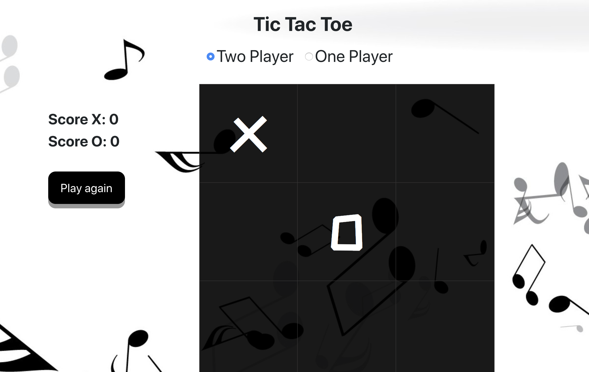

# Tic Tac Toe

It is a game for two players, X and O, who take turns marking the spaces in a 3×3 grid. The player who succeeds in placing three of their marks in a horizontal, vertical, or diagonal row wins the game.

## Getting Started

These instructions will get you a copy of the project up and running on your local machine for development and testing purposes. See deployment for notes on how to deploy the project on a live system. [Play here](https://github.com/rawanah995)

## Features
* Accepting two players
* Accepting one player
* counting the scores for players

### Challenges

The most challenging Part is to make the player playing with the computer

## Favorite part

My favorit part ever is winning message

## Built With

* Java Script: used the random function to let the computer select random spot
* Html
* Css

## Up comming Features
* Add songs to the game
* Make the computer wins

## Acknowledgments/Thanks

* Moath Althawad [@mfalthaw](https://github.com/mfalthaw)
* Michael Finneran [@MicFin](https://github.com/MicFin)
* Usman Bashir [@Usman Bashir](https://github.com/usmanbashir) 
* Rawan Alahmadi [@Rawan](https://github.com/rawanah995)

